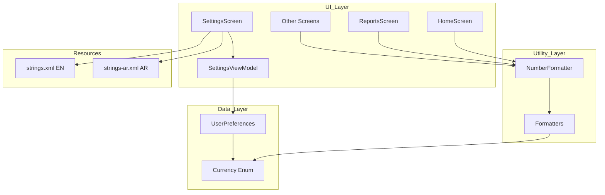
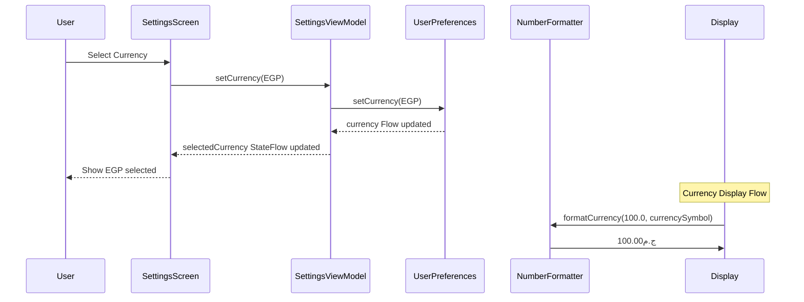

# Currency Chooser Feature Implementation Plan

## Overview
Allow users to select their preferred currency symbol (e.g., $ for USD, ج.م for Egyptian Pound) instead of relying on the system locale.

## Configuration Decisions
- **Default Currency**: EGP (Egyptian Pound)
- **Symbol Position**: Before amount (e.g., ج.م100.00)
- **Number Formatting**: Keep current locale formatting (decimal/thousands separators)
- **RTL Support**: Yes, flip position for Arabic users

## Architecture Overview



## Data Flow



## Implementation Details

### 1. Data Layer - Preferences

#### 1.1 Create Currency.kt
**Location**: `app/src/main/java/com/financialmanager/app/data/entities/Currency.kt`

```kotlin
package com.financialmanager.app.data.entities

enum class Currency(val code: String, val symbol: String) {
    USD("USD", "$"),
    EGP("EGP", "ج.م"),
    EUR("EUR", "€"),
    SAR("SAR", "ر.س");
    
    companion object {
        fun fromCode(code: String): Currency {
            return values().find { it.code == code } ?: EGP
        }
    }
}
```

#### 1.2 Modify UserPreferences.kt
**Location**: `app/src/main/java/com/financialmanager/app/data/preferences/UserPreferences.kt`

**Changes**:
- Add `CURRENCY` preference key
- Add `currency` Flow to observe currency changes
- Add `setCurrency()` function to save preference

```kotlin
// Add to PreferencesKeys object
val CURRENCY = stringPreferencesKey("currency")

// Add new Flow
val currency: Flow<Currency> = context.dataStore.data
    .map { preferences ->
        val code = preferences[PreferencesKeys.CURRENCY] ?: Currency.EGP.code
        Currency.fromCode(code)
    }

// Add new function
suspend fun setCurrency(currency: Currency) {
    context.dataStore.edit { preferences ->
        preferences[PreferencesKeys.CURRENCY] = currency.code
    }
}
```

### 2. Utility Layer - Formatters

#### 2.1 Modify NumberFormatter.kt
**Location**: `app/src/main/java/com/financialmanager/app/util/NumberFormatter.kt`

**Changes**:
- Add `currencySymbol` parameter to `formatCurrency()`
- Apply custom currency symbol to formatted output
- Handle RTL support for Arabic

```kotlin
fun formatCurrency(
    value: Double?, 
    hideNumbers: Boolean,
    currencySymbol: String = Currency.EGP.symbol,
    isRTL: Boolean = false
): String {
    if (value == null) return if (hideNumbers) "****" else "$0.00"
    
    return if (hideNumbers) {
        val formatter = NumberFormat.getNumberInstance(Locale.getDefault())
        val formattedValue = formatter.format(value)
        formattedValue.replace(Regex("[0-9٠-٩]"), "*")
    } else {
        val formatter = NumberFormat.getNumberInstance(Locale.getDefault())
        val formattedNumber = formatter.format(value)
        
        // Apply currency symbol based on RTL
        if (isRTL) {
            "$formattedNumber $currencySymbol"
        } else {
            "$currencySymbol$formattedNumber"
        }
    }
}
```

#### 2.2 Modify Formatters.kt
**Location**: `app/src/main/java/com/financialmanager/app/util/Formatters.kt`

**Changes**:
- Add overloaded `formatCurrency()` that accepts currency symbol
- Add RTL support parameter

```kotlin
fun formatCurrency(
    amount: Double?, 
    currencySymbol: String = Currency.EGP.symbol,
    isRTL: Boolean = false
): String {
    return amount?.let { 
        val formatter = NumberFormat.getNumberInstance(Locale.getDefault())
        val formattedNumber = formatter.format(it)
        
        if (isRTL) {
            "$formattedNumber $currencySymbol"
        } else {
            "$currencySymbol$formattedNumber"
        }
    } ?: "$0.00"
}
```

### 3. UI Layer - Settings

#### 3.1 Modify SettingsViewModel.kt
**Location**: `app/src/main/java/com/financialmanager/app/ui/screens/settings/SettingsViewModel.kt`

**Changes**:
- Add `selectedCurrency` StateFlow
- Add `setCurrency()` function

```kotlin
private val _selectedCurrency = MutableStateFlow(Currency.EGP)
val selectedCurrency: StateFlow<Currency> = _selectedCurrency.asStateFlow()

fun setCurrency(currency: Currency) {
    viewModelScope.launch {
        userPreferences.setCurrency(currency)
        _selectedCurrency.value = currency
    }
}
```

#### 3.2 Modify SettingsScreen.kt
**Location**: `app/src/main/java/com/financialmanager/app/ui/screens/settings/SettingsScreen.kt`

**Changes**:
- Add currency selection card similar to language selection
- Add currency selection dialog with list of currencies
- Show current selected currency in settings

```kotlin
// Add currency state
val selectedCurrency by viewModel.selectedCurrency.collectAsState()
var showCurrencyDialog by remember { mutableStateOf(false) }

// Add currency card in LazyColumn
item {
    Card(
        modifier = Modifier
            .fillMaxWidth()
            .clickable { showCurrencyDialog = true }
    ) {
        Row(
            modifier = Modifier
                .fillMaxWidth()
                .padding(16.dp),
            horizontalArrangement = Arrangement.SpaceBetween,
            verticalAlignment = Alignment.CenterVertically
        ) {
            Row(
                verticalAlignment = Alignment.CenterVertically,
                horizontalArrangement = Arrangement.spacedBy(16.dp)
            ) {
                Icon(
                    Icons.Default.AttachMoney,
                    contentDescription = null,
                    tint = MaterialTheme.colorScheme.primary
                )
                Column {
                    Text(
                        text = stringResource(R.string.currency),
                        style = MaterialTheme.typography.titleMedium,
                        fontWeight = FontWeight.Bold
                    )
                    Text(
                        text = getCurrencyDisplayName(selectedCurrency),
                        style = MaterialTheme.typography.bodyMedium,
                        color = MaterialTheme.colorScheme.onSurfaceVariant
                    )
                }
            }
            Icon(
                Icons.Default.ChevronRight,
                contentDescription = null,
                tint = MaterialTheme.colorScheme.onSurfaceVariant
            )
        }
    }
}

// Add currency selection dialog
if (showCurrencyDialog) {
    AlertDialog(
        onDismissRequest = { showCurrencyDialog = false },
        title = { Text(stringResource(R.string.select_currency)) },
        text = {
            Column {
                Currency.values().forEach { currency ->
                    CurrencyOption(
                        currency = currency,
                        isSelected = selectedCurrency == currency,
                        onSelect = {
                            viewModel.setCurrency(currency)
                            showCurrencyDialog = false
                        }
                    )
                }
            }
        },
        confirmButton = {
            TextButton(onClick = { showCurrencyDialog = false }) {
                Text(stringResource(R.string.cancel))
            }
        }
    )
}

@Composable
private fun CurrencyOption(
    currency: Currency,
    isSelected: Boolean,
    onSelect: () -> Unit
) {
    Row(
        modifier = Modifier
            .fillMaxWidth()
            .clickable { onSelect() }
            .padding(vertical = 12.dp, horizontal = 8.dp),
        horizontalArrangement = Arrangement.SpaceBetween,
        verticalAlignment = Alignment.CenterVertically
    ) {
        Text(
            text = getCurrencyDisplayName(currency),
            style = MaterialTheme.typography.bodyLarge
        )
        if (isSelected) {
            Icon(
                Icons.Default.Check,
                contentDescription = null,
                tint = MaterialTheme.colorScheme.primary
            )
        }
    }
}

@Composable
private fun getCurrencyDisplayName(currency: Currency): String {
    return when (currency) {
        Currency.USD -> stringResource(R.string.currency_usd)
        Currency.EGP -> stringResource(R.string.currency_egp)
        Currency.EUR -> stringResource(R.string.currency_eur)
        Currency.SAR -> stringResource(R.string.currency_sar)
    }
}
```

### 4. Resources

#### 4.1 Modify strings.xml (English)
**Location**: `app/src/main/res/values/strings.xml`

Add these strings:
```xml
<!-- Currency Settings -->
<string name="currency">Currency</string>
<string name="select_currency">Select Currency</string>
<string name="currency_usd">US Dollar ($)</string>
<string name="currency_egp">Egyptian Pound (ج.م)</string>
<string name="currency_eur">Euro (€)</string>
<string name="currency_sar">Saudi Riyal (ر.س)</string>
```

#### 4.2 Modify strings-ar.xml (Arabic)
**Location**: `app/src/main/res/values-ar/strings.xml`

Add these strings:
```xml
<!-- Currency Settings -->
<string name="currency">العملة</string>
<string name="select_currency">اختر العملة</string>
<string name="currency_usd">دولار أمريكي ($)</string>
<string name="currency_egp">جنيه مصري (ج.م)</string>
<string name="currency_eur">يورو (€)</string>
<string name="currency_sar">ريال سعودي (ر.س)</string>
```

### 5. Integration - Update Currency Formatting Across Screens

The following screens need to be updated to use the new currency preference:

#### 5.1 HomeScreen.kt
- Update `NumberFormatter.formatCurrency()` calls to pass currency symbol and RTL flag

#### 5.2 ReportsScreen.kt
- Replace `NumberFormat.getCurrencyInstance()` with custom formatter

#### 5.3 RecentOperationsScreen.kt
- Update `currencyFormat` to use custom currency symbol

#### 5.4 PersonDetailScreen.kt
- Replace `NumberFormat.getCurrencyInstance()` with custom formatter

#### 5.5 PeopleScreen.kt
- Update all `NumberFormat.getCurrencyInstance()` calls

#### 5.6 InventoryScreen.kt
- Update `formatter` to use custom currency symbol

#### 5.7 TransactionScreen.kt
- Update all `NumberFormat.getCurrencyInstance()` calls

#### 5.8 CapitalScreen.kt
- Update `formatter` to use custom currency symbol

#### 5.9 SalesArchiveScreen.kt
- Update `currencyFormat` to use custom currency symbol

## Testing Checklist

- [ ] Currency selection persists across app restarts
- [ ] Currency symbol updates in all screens
- [ ] HideNumbers functionality works with custom currency symbols
- [ ] RTL support works correctly in Arabic mode
- [ ] Default currency (EGP) is set on first launch
- [ ] All four currencies (USD, EGP, EUR, SAR) display correctly
- [ ] Currency symbol appears before amount in LTR mode
- [ ] Currency symbol appears after amount in RTL mode
- [ ] Number formatting (decimal/thousands separators) respects locale

## File Summary

| File | Action | Description |
|------|--------|-------------|
| `Currency.kt` | NEW | Enum class for supported currencies |
| `UserPreferences.kt` | MODIFY | Add currency preference |
| `NumberFormatter.kt` | MODIFY | Add currency symbol parameter |
| `Formatters.kt` | MODIFY | Add overloaded formatCurrency() |
| `SettingsViewModel.kt` | MODIFY | Add currency state and setCurrency() |
| `SettingsScreen.kt` | MODIFY | Add currency selection UI |
| `strings.xml` | MODIFY | Add currency strings (English) |
| `strings-ar.xml` | MODIFY | Add currency strings (Arabic) |
| `HomeScreen.kt` | MODIFY | Use custom currency symbol |
| `ReportsScreen.kt` | MODIFY | Use custom currency symbol |
| `RecentOperationsScreen.kt` | MODIFY | Use custom currency symbol |
| `PersonDetailScreen.kt` | MODIFY | Use custom currency symbol |
| `PeopleScreen.kt` | MODIFY | Use custom currency symbol |
| `InventoryScreen.kt` | MODIFY | Use custom currency symbol |
| `TransactionScreen.kt` | MODIFY | Use custom currency symbol |
| `CapitalScreen.kt` | MODIFY | Use custom currency symbol |
| `SalesArchiveScreen.kt` | MODIFY | Use custom currency symbol |
